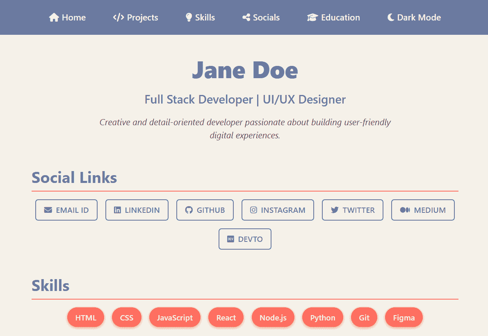
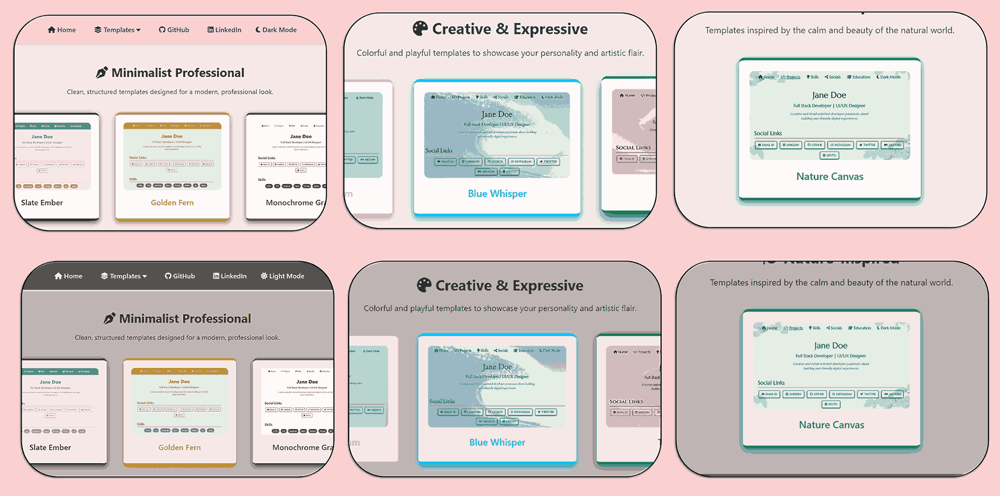
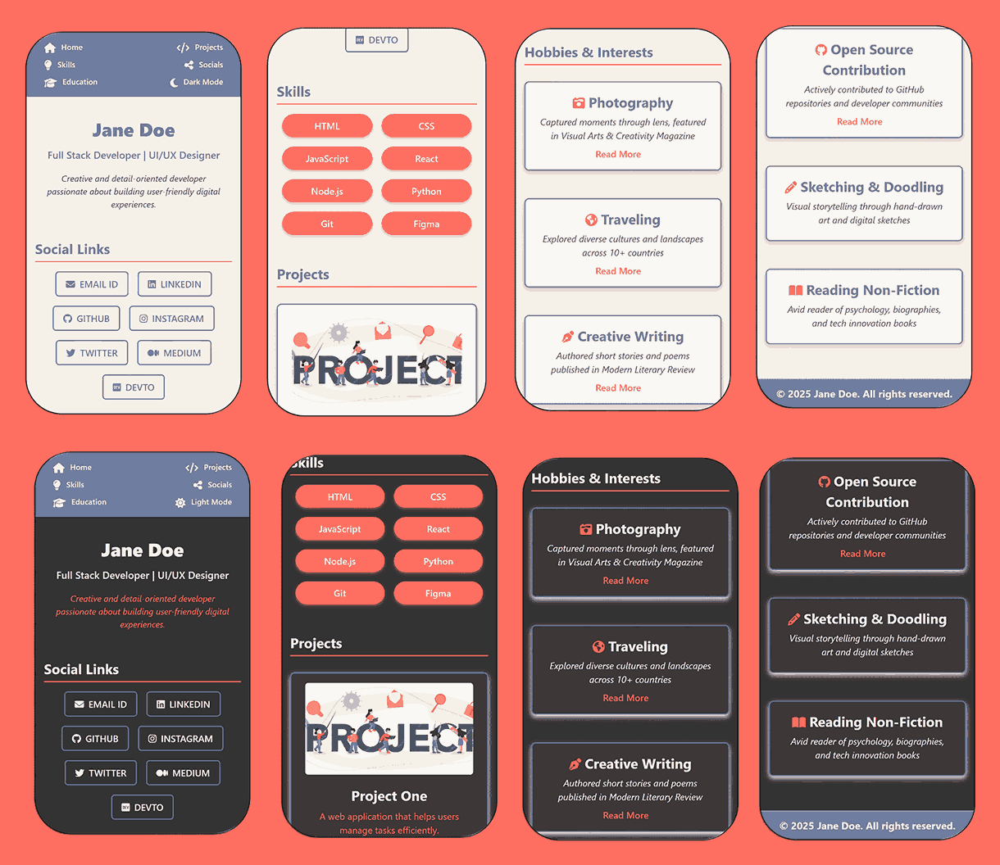

# 🙌 Contributing to Portfolio-Templates

Thank you for your interest in contributing! 🎨🚀 This repository is a curated collection of creative, minimalist, and professional portfolio templates.

**Want to contribute a new theme or template?**
You’re welcome! Here's how you can contribute based on your needs:

### 🧶 If You Have a New **Theme** (under existing template)

* 📩 Open a new issue or message me with:

  * 🎨 Theme name
  * 🎨 Color palette
  * 🌄 Background image or design ideas (optional)

### 📁 If You’re Adding It Yourself:

1. **Create a new folder** inside the appropriate template (e.g., `Minimalist_Professional/Your_Theme`).
2. 🧱 Follow the folder structure below exactly.

---

## 📁 Folder Structure Guidelines

> [!NOTE]
Follow the naming convention: Capitalized names with underscores, e.g., `Blue_Whisper`

```bash
Portfolio-Templates/
│
├── assets/                             # 🧩 Global assets and resources
│   ├── user_data/                      # 📄 JSON files for user data (e.g., social_links.json, user.json)
│   └── images/                         # 🖼️ Icons and visual assets used across all templates
│
├── Template_Name/                     # 🎨 Template folder with multiple themes (e.g., Minimalist_Professional)
│   ├── 📄 README.md                       # 📘 Overview of this template and its themes
│   ├── css/                            # 🎨 Base CSS styles
│   │   ├── main-styles.css               # 🧱 Base styles
│   │   ├── variables.css                 # 🎨 Theme color tokens and CSS variables
│   │   └── responsive-styles.css         # 📱 Responsive media queries
│   │
│   └── Theme_Name/                    # 🖌️ Individual theme folder (e.g., Slate_Ember, Golden_Fern)
│       ├── 📄 README.md                   # 📘 Theme-specific notes and usage
│       ├── index.html                    # 🏠 Theme homepage
│       ├── css/                       # 🎨 Theme-specific styles
│       │   ├── index.css                 # ☀️ Light mode styles
│       │   └── index-dark.css            # 🌙 Dark mode styles
│       └── site-previews/             # 🔍 Preview images for the theme
│           ├── website_1.png            # 🖼️ Meta tag / OG image
│           ├── desktop_website.png      # 🖥️ Desktop preview
│           └── mobile_website.png       # 📱 Mobile preview
│
├── Template_Name/                     # 🖼️ Template folder without themes (supports dark/light mode)
│   ├── 📄 README.md                       # 📘 Description of the standalone template
│   ├── css/                            # 🎨 Base + theme styles
│   │   ├── main-styles.css               # 🧱 Base styles
│   │   ├── variables.css                 # 🎨 Theme color tokens
│   │   ├── responsive-styles.css         # 📱 Media queries
│   │   ├── index.css                     # ☀️ Light mode styles
│   │   └── index-dark.css                # 🌙 Dark mode styles
│   ├── index.html                        # 🏠 Main HTML file
│   └── site-previews/                 # 🔍 Preview images
│       ├── website_1.png                # 🖼️ Meta tag / OG image
│       ├── desktop_website.png          # 🖥️ Desktop preview
│       └── mobile_website.png           # 📱 Mobile preview
│
├── js/                                # ⚙️ JavaScript for all templates
│   └── index.js                          # 📡 Central script to fetch and inject user data
│
├── Setup_Files/                       # 🛠️ Python scripts for automated setup
│   └── 📄 README.md                       # 📘 Instructions for using setup utilities
│
├── Localhost_Setup/                   # 🌐 Local server launch configs (e.g., Jekyll)
│
├── 📄 README.md                           # 📘 Overview of the entire Portfolio-Templates project
├── 📄 LICENSE.md                         # 📜 License terms and usage permissions
├── 📄 CONTRIBUTING.md                    # 🧑‍💻 Contribution guidelines
└── 📄 Templates.md                       # 📚 Overview of all templates and themes
```

---

## 🧠 Styling & Data Setup

> [!TIP]
> Use **`index.js`** to dynamically import JSON user data (`user.json`, `social_links.json`) for consistent user configuration.

### 🌈 Stylesheet Inclusion

```html
<link rel="stylesheet" href="css/main-styles.css" />
<link rel="stylesheet" href="css/variables.css" />
<link rel="stylesheet" href="css/index.css" />
<link rel="stylesheet" href="css/index-dark.css" />
<link rel="stylesheet" href="css/responsive-styles.css" />
```

### 🔖 Meta Tags for SEO & Social Sharing

Include the following in every theme’s `index.html`:

```html
<head>
  <meta charset="UTF-8" />
  <meta name="viewport" content="width=device-width, initial-scale=1.0" />
  <title>Portfolio Templates by Madhurima Rawat</title>

  <!-- SEO Meta -->
  <meta name="description" content="..." />
  <meta name="keywords" content="..." />
  <meta name="author" content="Madhurima Rawat" />

  <!-- Open Graph / Twitter -->
  <meta property="og:image" content="site-previews/website_1.png" />
  <meta name="twitter:image" content="site-previews/website_1.png" />

  <!-- Favicon & Fonts -->
  <link rel="icon" href="{{ site.baseurl }}/assets/images/title-icon.png" />
  <link rel="stylesheet" href="https://cdnjs.cloudflare.com/ajax/libs/font-awesome/6.4.0/css/all.min.css" />
</head>
```

### `README.MD` Addition

Include a separate README for each template and its associated theme (if applicable):

```markdown
# 🌸 Template/Theme Name – [Short Tagline or Mood]

[1–2 line description summarizing the design vibe, layout style, or target users. This intro should capture the essence.]

🎨 **Color Palette Highlights** (see [`css/variables.css`](css/variables.css)):

* `--color-primary`: ... – [Brief role, e.g., "Soft lilac for primary accents"]
* `--color-secondary`: ... – [e.g., "Muted plum for depth"]
* `--color-bg`: ... – [Background or base tone]
* `--color-hover`: ... – [Hover/interact feedback]
* *(add or remove tokens as needed)*

🔗 [Live Demo](https://madhurimarawat.github.io/Portfolio-Templates/Template_Or_Theme_Path)

---

### 📱 Fully Responsive & Dual-Mode Ready

Supports mobile, tablet, and desktop views with **🌞 light** and **🌙 dark** modes automatically toggled by system preference or toggle logic.

---

### 📸 Snapshots

<div align="center">

<a href="https://madhurimarawat.github.io/Portfolio-Templates/Template_Or_Theme_Path">
  
</a>

<a href="https://madhurimarawat.github.io/Portfolio-Templates/Template_Or_Theme_Path">
  
</a>

<a href="https://madhurimarawat.github.io/Portfolio-Templates/Template_Or_Theme_Path">
  
</a>

</div>

---

### 💡 Perfect For:

* 🖋️ **[Type of users]** — e.g., Writers, Designers, Developers
* 🌱 **[Use case]** — e.g., Clean resumes, Minimal personal sites
* 🎨 **[Aesthetic appeal]** — e.g., Nature-themed, Monochrome lovers

🔙 [Back to All Templates](../Templates.md)
```

Use `[Back to All Templates](../Templates.md)` for templates, and `[Back to All Templates](../../Templates.md)` for themes located inside a template folder.

---

## 🔁 Update These Files for New Templates

### 📂 [`Setup_Files/Template_Selector.py`](Setup_Files/Template_Selector.py)

> [!CAUTION]
> If your template includes multiple themes, add your template name in the `selected_template` logic block to enable theme selection.

```python
if selected_template == "Minimalist_Professional" or selected_template == "Your_Template_Name":
```

---

### 🗂️ [`Templates.md`](Templates.md)

> [!WARNING]
> Don’t skip this! Every new template or theme **must** be listed with:

* 🔗 Folder link
* 🌐 Live preview link
* 🎨 Color palette description
* 📐 Font & layout details

Example block:

```markdown
## 🌸 Blue Whisper – Elegant New Template [Blue_Whisper](Blue_Whisper)

A tranquil template inspired by soft blues and white space.

🎨 **Palette**:
- --whisper-blue: #cbe7f3
- --night-ink: #1f2d3d

📝 **Typography**: 'Poppins', sans-serif  
🔗 [Live Preview](https://madhurimarawat.github.io/Portfolio-Templates/Blue_Whisper)
```

---

### 🆕 Adding a New **Template** or **Theme**? Here's How to Update Your `index.html`, `variables.css`, and `index.css`

#### 🧩 1. For a **New Template**

If you're adding a brand new **template**, create a **new `<section>` block** inside your main `index.html` file like this:

```html
<!-- 🌿 Nature-Inspired Templates -->
<section id="nature" class="template-section">
  <h2 class="section-heading"><i class="fas fa-leaf"></i> Nature-Inspired</h2>
  <p class="section-description">Templates inspired by the calm and beauty of the natural world.</p>
  
  <div class="card-container">
    <div class="section-card nature-canvas" data-href="{{ site.baseurl }}/Nature_Canvas">
      
      <a href="{{ site.baseurl }}/Nature_Canvas" class="section-link">Nature Canvas</a>
    </div>
  </div>
</section>
```

📌 **Note:**

* Use a unique `id` for your section (`id="nature"` above).
* Inside `.card-container`, add `.section-card` for your template.

#### 🎨 2. For a **New Theme under an Existing Template**

Just add a new `.section-card` inside the existing `<section>` like this:

```html
<div class="section-card nature-canvas" data-href="{{ site.baseurl }}/Nature_Canvas">
  
  <a href="{{ site.baseurl }}/Nature_Canvas" class="section-link">Nature Canvas</a>
</div>
```

#### 🎨 3. Update `variables.css`

Add a new color variable for your theme:

```css
/* === Nature-Inspired === */
--color-nature-canvas: #1ba35d;
```

#### 🎨 4. Update `index.css` Styling

Add section-specific card styles for border, shadow, and hover:

```css
/* Nature Section Cards */
#nature .section-card:nth-child(1) {
  border-block: 5px solid var(--color-nature-canvas);
  box-shadow: 0 4px 12px var(--color-nature-canvas);
}

#nature .section-card:nth-child(1) .section-link {
  color: var(--color-nature-canvas);
}

/* Nature Section Cards Hover */
#nature .section-card:nth-child(1):hover {
  box-shadow: 0 10px 18px var(--color-nature-canvas);
}
```

📝 **Summary**

* ✨ Templates ➜ Add a new section in `index.html`
* 🎨 Themes ➜ Add a new `.section-card` inside an existing section
* 🎨 Add color in `variables.css`
* 🧑‍🎨 Style in `index.css` using `nth-child` selectors

---

## 📸 Site Previews

> [!TIP]
> Add **desktop**, **mobile**, and **OG image** under:
`Template_Name/Theme_Name/site-previews/`

### 📥 How to Make Site Previews

1. 📷 Take screenshots of the live page.
2. 🗜️ Compress them via: [11zon Image Compressor](https://www.11zon.com/clear/?page_url=https://imagecompressor.11zon.com/en/image-compressor/)
3. 🎨 Use the provided PPT templates:

   * [`Desktop_Site_Preview_Design.pptx`](Site_Preview_Design/Desktop_Site_Preview_Design.pptx)
   * [`Mobile_Site_Preview_Design.pptx`](Site_Preview_Design/Mobile_Site_Preview_Design.pptx)
4. Export slides as `.png` → Add to `site-previews/`

---

## 🧑‍💻 Submit a Pull Request

When you're done, [submit a PR](https://github.com/madhurimarawat/Portfolio-Templates/pulls) to `main`.

* Use the official PR template → [`.github/PULL_REQUEST_TEMPLATE.md`](https://github.com/madhurimarawat/Portfolio-Templates/blob/main/.github/PULL_REQUEST_TEMPLATE.md)
* Mention if your template supports **dark mode**
* Include preview image(s) and demo link

## 💌 Need Help?

Open an issue using the [Issue Template](https://github.com/madhurimarawat/Portfolio-Templates/issues) if you:

* Need guidance
* Want design feedback
* Are unsure where to start

🔹 **Issue Templates Available:**

* 🆕 [New Template/Theme Request](https://github.com/madhurimarawat/Portfolio-Templates/issues/new?template=new-template-theme-request.md) – Propose a new theme or layout
* 🛠️ [Bug Report](https://github.com/madhurimarawat/Portfolio-Templates/issues/new?template=bug_report.md) – Report any issues or glitches
* 💡 [Feature Request](https://github.com/madhurimarawat/Portfolio-Templates/issues/new?template=feature_request.md) – Suggest improvements or additions
* 🧪 [Example Usage Submission](https://github.com/madhurimarawat/Portfolio-Templates/issues/new?template=example-usage-submission.md) – Share how you're using the template

Thanks for contributing! 🌟
Let’s build a vibrant collection of creative, professional portfolios. 🎨🚀
Happy Contributing!
