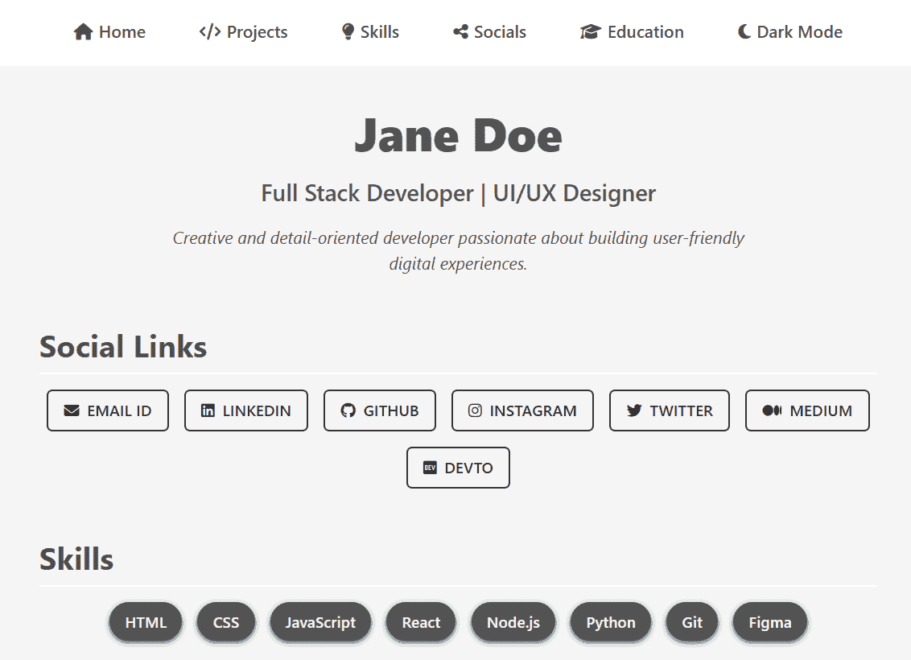
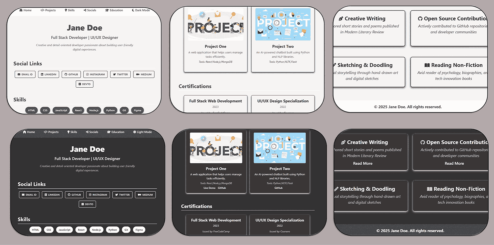
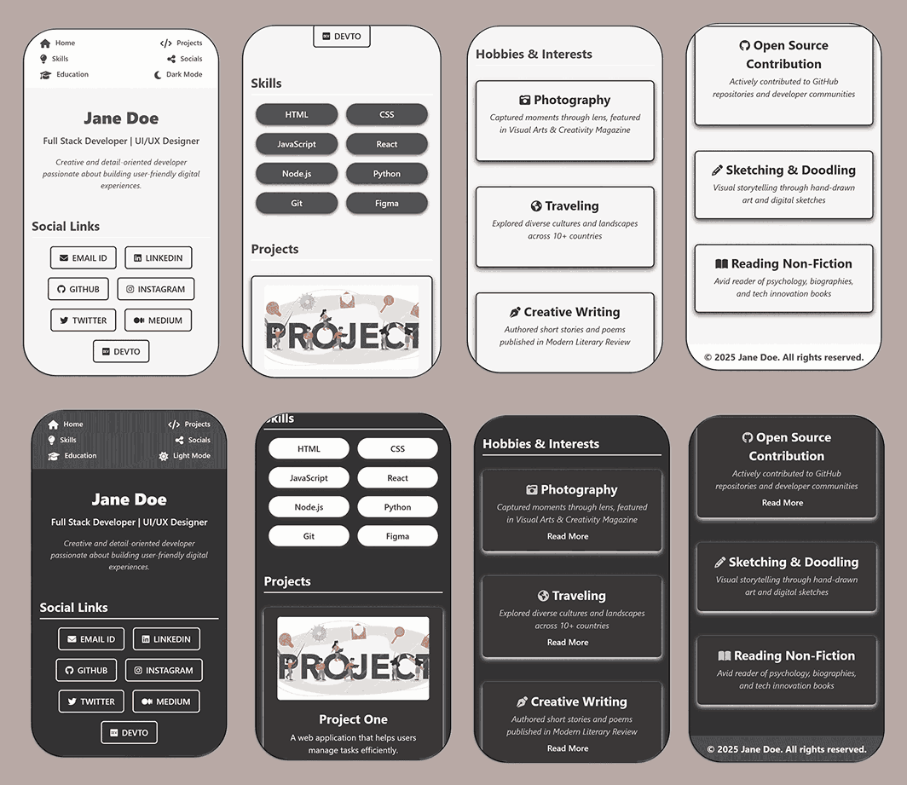

# ⚪⚫ Monochrome Grace – Timeless Neutral Portfolio Template

A sleek and sophisticated portfolio template that embraces **shades of black, white, and soft greys**, perfect for individuals who prefer a clean, distraction-free presentation of their work. Monochrome Grace delivers quiet confidence and universal appeal through its timeless simplicity.

🎨 **Color Palette Highlights** (see [`css/variables.css`](../css/variables.css) for full theme definitions):

* `--white`: #ffffff – Pure white for backgrounds and cards
* `--light-grey`: #dcdcdc – Gentle soft grey for sections
* `--gray`: #777777 – Medium grey for text and UI
* `--dark-grey`: #2f2f2f – Deep grey for headers and footers
* `--black`: #000000 – Strong contrast for emphasis

⚫ **Design Accents**:

* High readability with clear text contrast
* Flat UI style with refined card borders and light shadows
* Graceful hover states with subtle darkening or underlines

📝 **Typography & Elements**:

* Font: `'Segoe UI', Tahoma, Geneva, Verdana, sans-serif` – Neutral and professional
* Layout: Balanced margins and grid-based structure for order and precision
* Buttons: Minimal with sleek transitions and strong contrast

🔗 [Live Demo](https://madhurimarawat.github.io/Portfolio-Templates/Minimalist_Professional_Monochrome_Grace)

### 🌟 Fully Responsive & Accessible

Monochrome Grace scales elegantly across **📱 phones**, **💻 desktops**, and both **🌞 light** and **🌙 dark modes**, maintaining legibility and consistency.

### 📸 Snapshots

### 💡 Perfect For:

* 🖋️ **Writers, editors, and bloggers** who want text to shine
* 🎓 **Students or professionals** who prefer focused simplicity
* 🧑‍💻 **Developers and analysts** who value clean design without distractions

🔙 [Back to All Templates](../../Templates.md)