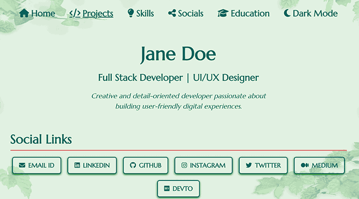
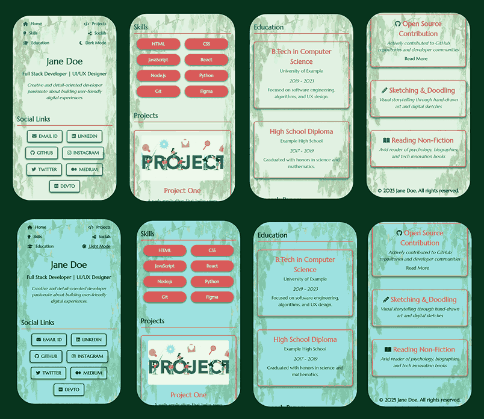
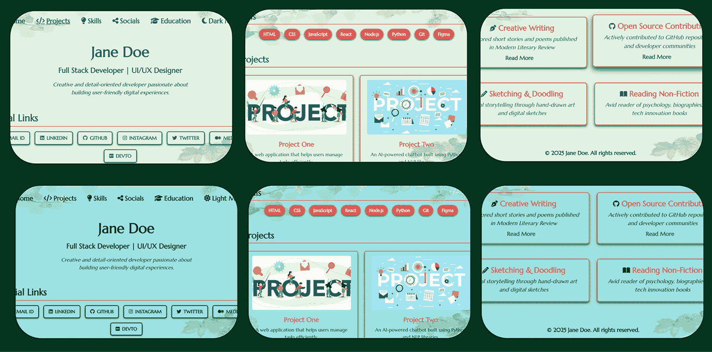

# 🌱 Nature Canvas – Earthy Portfolio Template

A modular and refreshing portfolio template inspired by nature’s calm, featuring smooth gradients, earth-toned contrasts, and typography that evokes organic elegance. Ideal for presenting personal or creative projects with a natural, grounded aesthetic.

🎨 **Color Palette Highlights** (see [`css/variables.css`](css/variables.css) for full theme definitions):

* `--light-green`: #e1f1e2 – Mint pastel for subtle highlights
* `--red`: #d85d5d – Earthy rose as a gentle accent
* `--dark-green`: #094929 – Pine green for contrast and depth
* `--teal`: rgb(6, 100, 100) – Deep, cool oceanic tone
* `--hover-green`: green – Fresh interactive feedback
* `--light-teal`: rgb(156, 225, 225) – Cool, light balance
* `--dark-green-text`: #06341d – Forest ink for elegance and readability

🔗 [Live Demo](https://madhurimarawat.github.io/Portfolio-Templates/Nature_Canvas)

### 📱 Fully Responsive & Dual-Mode Ready

This template is **100% responsive** on all devices and includes seamless support for both **🌞 light mode** and **🌙 dark mode** for accessibility and aesthetic flexibility.

### 📸 Snapshots

### 💡 Perfect For:

* 🌿 **Nature lovers, eco-friendly brands, or sustainability advocates** who want their work to reflect natural harmony.
* 🖼️ **Creative portfolios or minimal showcases** that benefit from calm tones and organic elegance.
* 📖 **Writers, poets, or educators** looking to present content in a grounded and soothing environment.

🔙 [Back to All Templates](../Templates.md)

🖼️ **Background image credit:**

[Green Leaves Frame – Transparent PNG](https://www.nicepng.com/png/full/78-788269_green-leaves-frame-transparent-background-border-leaves.png)

*Thanks to the original artist for this beautiful nature frame.*