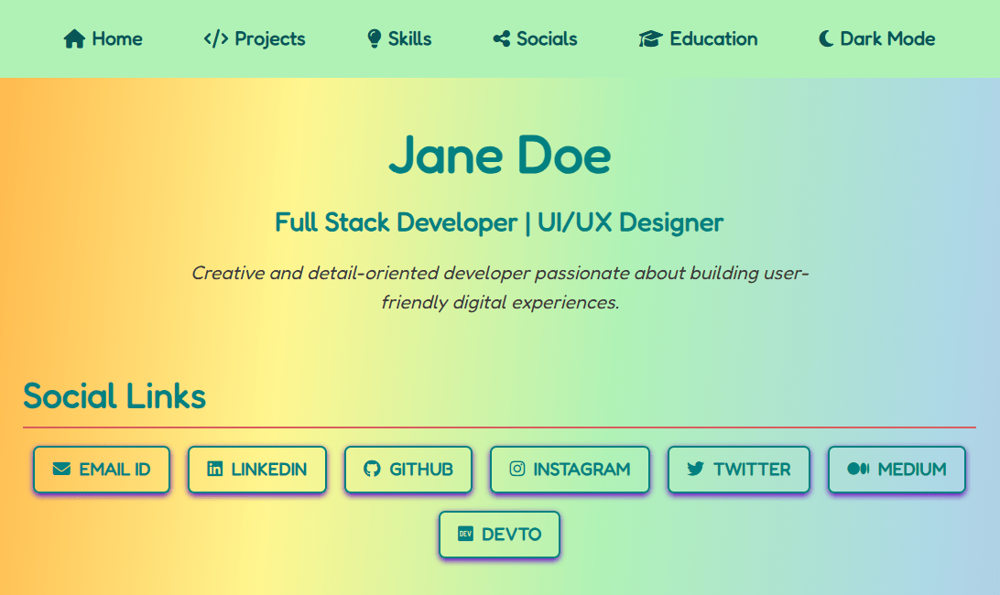
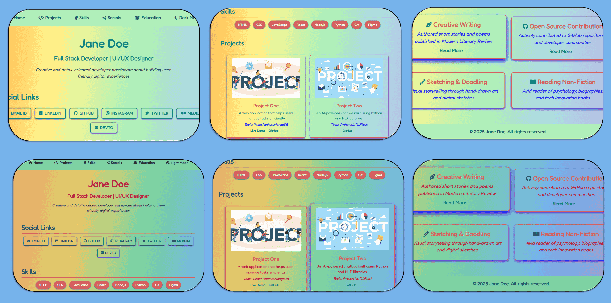
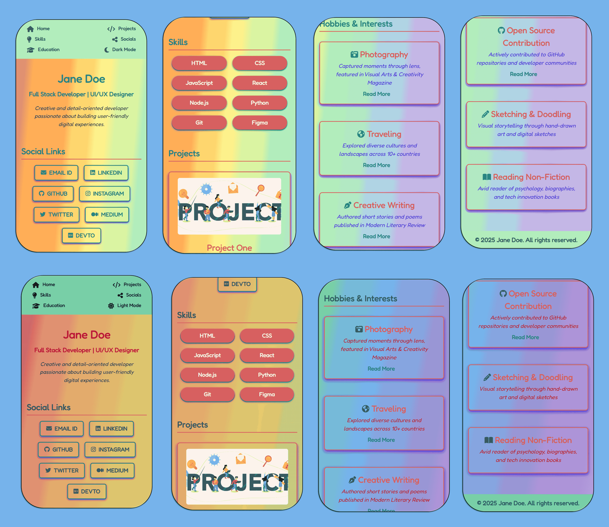

# 🌈 Rainbow Spectrum – Playful Portfolio Template

A vibrant and cheerful portfolio template designed with softly blended rainbow pastels, light gradients, and a fun, modern typeface. Ideal for creative spirits who want their work to radiate positivity, color, and charm across all devices and themes.

🎨 **Color Palette Highlights** (see [`css/variables.css`](css/variables.css) for full theme definitions):

* `--light-red`: #ff8a8a – Light pinkish red
* `--light-orange`: #ffb347 – Soft carrot orange
* `--light-yellow`: #fff68f – Gentle buttery yellow
* `--light-green`: #b0f2b6 – Mint pastel green
* `--light-blue`: #add8e6 – Baby blue breeze
* `--light-indigo`: #c3b1e1 – Muted lavender
* `--light-violet`: #e1b3ff – Pale orchid glow

✨ **Dark Mode Accents**:

* `--dark-mode-red`: #d26a6a – Soft cherry
* `--dark-mode-orange`: #e6a96c – Creamy apricot
* `--dark-mode-yellow`: #e0cf6a – Mellow gold
* `--dark-mode-green`: #78d2a5 – Mint jade
* `--dark-mode-blue`: #76b3eb – Clear sky
* `--dark-mode-indigo`: #9d92d1 – Lavender dusk
* `--dark-mode-violet`: #c491dd – Lilac mauve

🌄 **Background Gradients**:

* `--rainbow-bg`: A lively light theme gradient blended across all pastel rainbow tones
* `--rainbow-dark-bg`: A muted, deep gradient glowing over a dark base

📝 **Typography & Elements**:

* Font: `'Fredoka', sans-serif` – Rounded and friendly
* Text: Soft grays and whites with colorful accent hovers
* Buttons: Bright contrasts with playful shadows and smooth interactions

🔗 [Live Demo](https://madhurimarawat.github.io/Portfolio-Templates/Rainbow_Spectrum)

---

### 🌟 Fully Responsive & Theme Adaptive

Rainbow Spectrum is **fully responsive** and transitions seamlessly between **🌞 light mode** and **🌙 dark mode**, ensuring it shines on every screen and preference.

---

### 📸 Snapshots

---

### 💡 Perfect For:

* 🎨 **Designers and creators** who love color and brightness
* 💬 **Speakers, educators, or storytellers** looking to express with energy
* 📚 **Students and coders** who want a positive and welcoming online presence

🔙 [Back to All Templates](../Templates.md)