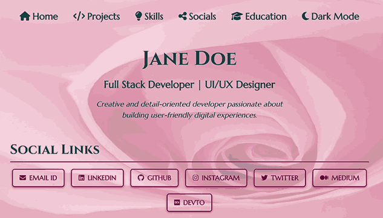
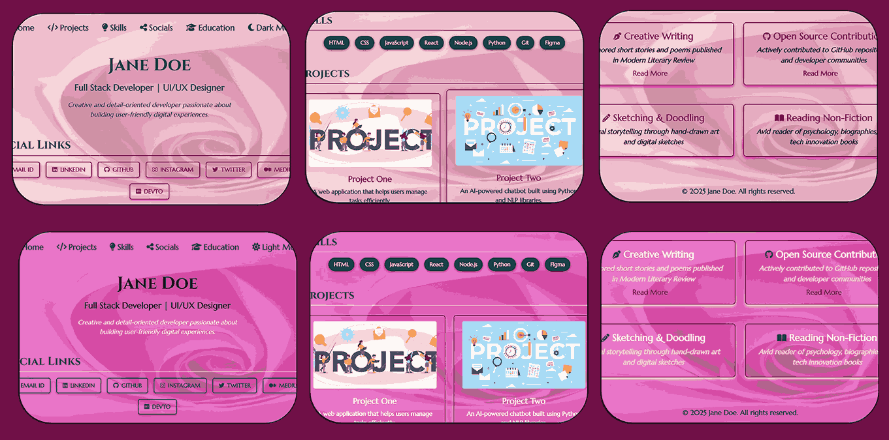
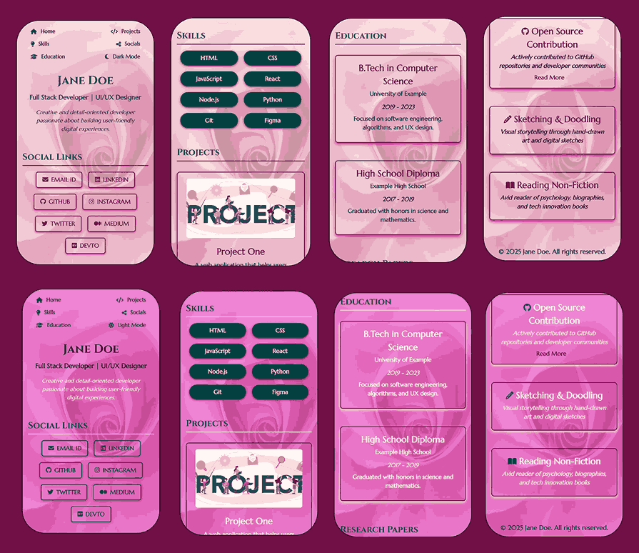

# 🌷 Teal Rose – Poetic Portfolio Template

A delicate and tranquil portfolio template crafted with soft teals, whispered pinks, and refined typography. Perfect for presenting creative, romantic, or personal work with an air of calm elegance.

🎨 **Color Palette Highlights** (see [`css/variables.css`](css/variables.css) for full theme definitions):

* `--light-teal`: rgb(93, 218, 218) – Gentle, calming brightness
* `--teal`: rgb(6, 70, 70) – Deep sea tone for depth
* `--dark-teal`: rgb(15, 66, 66) – Muted serenity
* `--light-pink`: rgb(241, 213, 218) – Rose mist for warmth
* `--light-pink-bg`: rgb(232, 103, 206) – Rosy background grace
* `--hover-pink`: #d81c87 – Soft mauve hover accent
* `--dark-pink-text`: #701047 – Romantic ink for headers
* `--light-text`: rgb(255, 246, 246) – Whisper-light content text
* `--dark-text`: #061e27 – Subtle contrast for readability

🔗 [Live Demo](https://madhurimarawat.github.io/Portfolio-Templates/Teal_Rose)

### 📱 Fully Responsive & Dual-Mode Ready

This template is **fully responsive** and gracefully adapts between **🌞 light mode** and **🌙 dark mode**, ensuring an elegant user experience across devices.

---

### 📸 Snapshots

### 💡 Perfect For:

* ✨ **Personal or romantic portfolios** with a soft, elegant visual tone
* 💼 **Creative professionals and designers** wanting a peaceful and polished presence
* 📝 **Writers, bloggers, and poets** who favor a graceful and charming style

🔙 [Back to All Templates](../Templates.md)

🖼️ **Background image credit:**

[Teal & Pink Rose Background – Pinterest View](https://in.pinterest.com/pin/1032661389546260052/)

*Original artwork created by me (Madhurima Rawat). Displayed here via Pinterest. You can also explore more of my floral artwork there.*